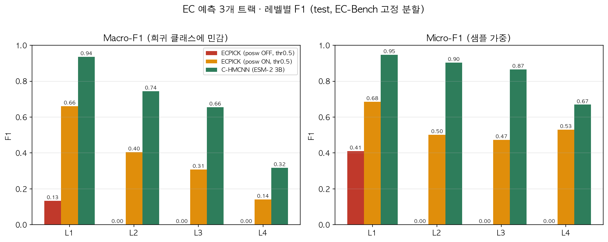

# UNLV Project 3 — 단백질 서열 기반 효소 EC 번호 예측

> **Enzyme EC Number Prediction from Protein Sequence**
> UNLV 2026 여름 연구 프로젝트 (4주) · 류도형 (Dohyeong Ryu)
> 지도: Dr. Mingon Kang
> 계산 환경: UNLV **REBELX** HPC (NVIDIA A30) · 데이터: **EC-Bench** 고정 분할

이 저장소는 **완료된 프로젝트의 최종 아카이브**입니다. 개인 담당 파트(ECPICK 재현 · C-HMCNN)의
코드 · 실험 스냅샷 · 결과 보고서와, 직접 작성한 수업 과제 · 시험 대비 정리를 포함합니다.

---

## 1. 무엇을 했나

효소의 기능을 나타내는 **EC 번호**(4단계 계층, 예: `1.2.99.10`)를 단백질 아미노산 서열만으로
예측한다. 담당 파트는 서로 다른 두 접근을 **같은 데이터 · 같은 평가 기준**으로 비교하는 것이었다.

| 트랙 | 모델 | 입력 | 요지 |
|---|---|---|---|
| **① ECPICK** (baseline 재현) | 서열 CNN (conv k=4/8/16 → 384d → 레벨별 sigmoid) | 아미노산 one-hot 21×1000 | 사전학습 임베딩 없이 서열에서 직접 학습. 논문 하이퍼파라미터 동일(ensemble 10, dropout 0.8, β=0.6) |
| **② C-HMCNN** | ESM-2 3B 임베딩 + 계층 인식 head | mean-pooled 임베딩 2,560d | base MLP 위에 **MCM**(Max Constraint Module)으로 "자식 확률 ≤ 부모 확률"을 구조적으로 강제, MCLoss로 학습 |

평가: 레벨별(L1~L4) macro/micro Precision · Recall · F1. 불완전 EC(`3.5.-.-`)는 아는 레벨만 반영.

---

## 2. 최종 결과 (EC-Bench test)

**Micro-F1** (샘플 가중 — 실사용 성능에 가까움)

| Level | ECPICK OFF@0.19 (논문 세팅) | ECPICK ON@0.5 | **C-HMCNN** |
|:---:|:---:|:---:|:---:|
| L1 | 0.411 | 0.685 | **0.947** |
| L2 | 0.000 | 0.501 | **0.904** |
| L3 | 0.000 | 0.473 | **0.866** |
| L4 | 0.000 | 0.529 | **0.669** |

**Macro-F1** (희귀 클래스까지 균등 반영)

| Level | ECPICK OFF@0.19 | ECPICK ON@0.5 | **C-HMCNN** |
|:---:|:---:|:---:|:---:|
| L1 | 0.133 | 0.660 | **0.936** |
| L2 | 0.000 | 0.404 | **0.743** |
| L3 | 0.000 | 0.307 | **0.656** |
| L4 | 0.000 | 0.142 | **0.317** |

> C-HMCNN은 n_eval=5,321, ECPICK은 n_eval=5,584로 평가 샘플 수가 약간 다르다(분할·라벨 처리 차이).
> 격차가 커서 순위 해석에는 영향이 없다.



### 핵심 발견 3가지

1. **ESM-2 3B 임베딩 + 계층 제약이 전 레벨 압승.** one-hot 서열만으로는 하위 레벨(L3/L4)에서
   기능을 가르는 미세한 차이를 담지 못한다. MCM이 상위 레벨의 확신을 하위로 전달해 L3/L4를 떠받친다.
2. **ECPICK은 `pos_weight` 없이는 붕괴하며, threshold로는 못 살린다.** pos_weight OFF 모델의
   레벨별 **최대** 출력 확률이 L2 0.16 / L3 0.07 / L4 0.02까지 깔려 있어, 어떤 threshold를 써도
   하위 레벨 양성이 0개가 된다(구조적 F1=0). 저장된 test 확률로 threshold 전 구간을 스윕해 확인했다.
3. **long-tail이 지배적 제약.** 클래스당 학습 예시가 **~100개**를 넘어야 recall이 살아난다
   (50개 이하 recall 0 → 101~500개 구간에서 급반등). 논문 학습셋(~2천만 서열)은 우리 train_ec
   (15.3만)의 약 130배라, 같은 pos_weight-OFF 조건에서도 결과가 갈리는 것으로 설명된다
   — **단, 이는 자체 빈도분석에서 도출한 가설이며 논문 스케일에서 직접 검증하지는 못했다.**

---

## 3. 저장소 구조

| 경로 | 내용 |
|---|---|
| **[report/](report/)** | ★ 최종 산출물. [`EC예측_결과보고서_0714.md`](report/EC예측_결과보고서_0714.md)(메인 보고서), [`ECPICK_결과_해석.md`](report/ECPICK_결과_해석.md) · [`HierEC_결과_해석.md`](report/HierEC_결과_해석.md)(트랙별 상세), [`Q&A_예상질문_대비.md`](report/Q&A_예상질문_대비.md), `figs/`(한글 그림) · `figs_en/`(영문 발표용 그림) |
| **[rebelx/](rebelx/)** | 유지보수 기준 코드 본체. `ecpick/`(서열 CNN 파이프라인 + 빈도분석 + 학습곡선), `hierec/`(C-HMCNN: hierarchy/model/losses/metrics/data/train), `prep_data.py`, Slurm `*.sbatch` |
| **[results_0714/](results_0714/)** | 2026-07-14 REBELX 실행 스냅샷(재현 기록). 실행 당시의 코드 사본 + Slurm 로그 + per-level/per-class CSV + 학습곡선 |
| **[HW/](HW/)** | 직접 작성한 수업 과제 HW1~HW4 (KNN / 회귀 / NN / CNN) — 노트북 · 리포트 · 결과 |
| **[Study/](Study/)** | 직접 정리한 시험 대비 자료(예상 문제·모범답안) |
| **[EXPERIMENT_PLAN.md](EXPERIMENT_PLAN.md)** | 초기 실험 계획 |
| `주간보고서_..._{3,4}주차_영문병기.docx` | 주간 보고서 (국문 + 영문 병기) |

> 대용량 원본 데이터(EC-Bench CSV, `ECPICK/data/`, `rebelx/data/`)와 raw 확률 덤프(`*.npz`)는
> `.gitignore`로 제외했다. 데이터셋은 팀 공용 저장소(비공개)의 `data/EC-Bench_data/`에 있다.
>
> 저작권 보호를 위해 **강의 슬라이드 · 과제 출제 문서 · 제공 데이터(MNIST 등)는 이 저장소에 포함하지 않았다.**
> 과제 노트북 재실행에는 해당 데이터를 별도로 받아야 한다.

---

## 4. 재현 방법

REBELX(Slurm + `ecpick` conda env) 기준. 데이터는 `id,seq,ec_number` 스키마의
`train_ec.csv` / `test_ec.csv`를 `rebelx/data/`에 두면 된다.

```bash
# 원본 CSV(Entry/Sequence/EC number) → 표준 스키마로 변환
python rebelx/prep_data.py

# ① ECPICK (서열 CNN, ESM 불필요)
cd rebelx/ecpick
sbatch run_ecpick.sbatch          # pos_weight ON, threshold 0.5
sbatch run_ecpick_posw.sbatch     # pos_weight OFF (논문 세팅 대조 실험)
tail -f ecpick_<jobid>.log
# → results/ECPICK__seq__train_ec.csv (레벨별 macro/micro F1)

# ② C-HMCNN (사전 추출한 ESM-2 3B feature 필요)
cd rebelx/hierec
python train.py --synthetic --epochs 100 --eval-every 20      # 배관 검증 (데이터 없이)
sbatch run_hier.sbatch                                        # 실제 학습 (300 epoch, A30에서 ~26분)
```

부가 분석:

```bash
python rebelx/ecpick/analyze_by_frequency.py   # 클래스 빈도 구간별 P/R/F1 (long-tail 분석)
python rebelx/ecpick/plot_curves.py            # 학습곡선
```

---

## 5. 참고 문헌

- **ESM-2** — Lin et al., *Science* (2023). 진화 규모 단백질 언어모델. 본 프로젝트에선 임베딩 추출기로 사용.
- **ECPICK** — Han et al., *Briefings in Bioinformatics* (2024), bbad401. 해석 가능한 서열 기반 EC 예측 CNN.
- **C-HMCNN** — Giunchiglia & Lukasiewicz, *NeurIPS* (2020). MCM으로 계층 일관성을 구조적으로 보장.
- **HIT-EC** — Dumontet et al., *Nature Communications* (2026). EC 4단계를 Transformer 4개로 모델링.
- **CLEAN** — Yu et al., *Science* (2023). contrastive learning 기반 EC 예측.
- **BLAST** — McGinnis & Madden (2004). 서열 유사도 기반 전통적 방법.

---

## 6. 관련 저장소

팀 공용 저장소(코드 + EC-Bench 데이터 + 최종 보고서)는 비공개로 운영되었다.
