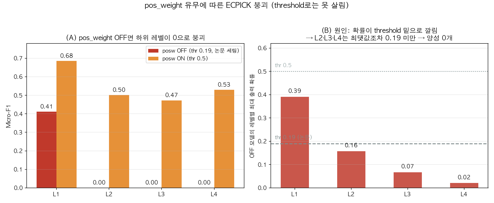
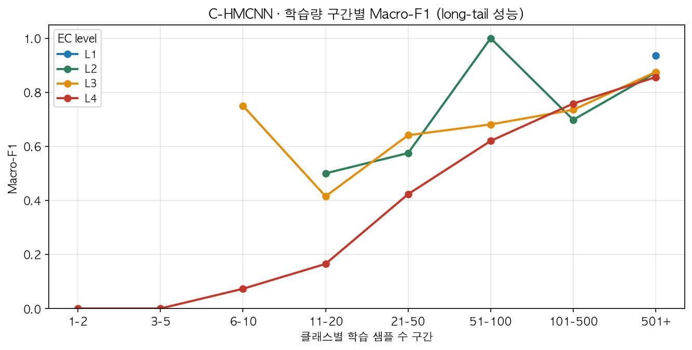
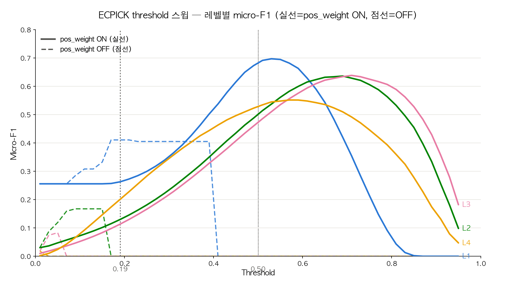

# 단백질 서열 기반 EC 번호 예측: ESM 임베딩 계층 모델과 서열 CNN 비교
## (Enzyme EC Number Prediction from Protein Sequence: Comparing an ESM-Embedding Hierarchical Model and a Sequence CNN)

**작성일:** 2026-07-14 (개정 2026-07-16) · **작성:** 도형 (UNLV enzyme EC-prediction project, Project 3)
**지도:** Dr. Mingon Kang · **멘토:** 백범수 · 전수형 · Phani Parsa
**데이터:** EC-Bench 고정 분할 (train_ec / test_ec) · **환경:** REBELX HPC, NVIDIA A30

---

## 0. 프로젝트 배경 및 의의 (Background & Significance)

효소의 기능(EC 번호)을 실험으로 직접 규명하는 것은 느리고 비용이 크다. 단백질 서열만으로 기능을 예측할 수 있으면, 메타게노믹스·산업 생명공학·효소 관련 질병 진단 등에서 아직 기능이 밝혀지지 않은 대량의 단백질을 빠르게 분류하고, 후속 실험의 방향을 효율적으로 설계하는 데 도움이 된다.

- **문제:** 단백질의 구조를 안다고 해서 기능이 자동으로 밝혀지지는 않으며, 기능을 실험만으로 규명하려면 많은 시간과 비용이 든다.
- **의의:** 서열 → 기능 예측 모델이 있으면 신약 개발(drug discovery), 대사공학(metabolic engineering), 합성생물학(synthetic biology) 등에서 미규명 단백질의 유력한 기능 후보를 빠르게 좁혀 후속 연구 방향을 설계할 수 있다.
- **본 프로젝트의 초점:** 서열만 사용하는 경량 CNN(ECPICK)과, 대형 사전학습 단백질 언어모델(ESM-2) 임베딩 위에 계층 인식 head(C-HMCNN)를 얹은 접근을 같은 데이터·평가 기준으로 직접 비교해, "얼마나 무거운 모델이 필요한가"와 "희귀 EC 클래스(long-tail)를 어떻게 다룰 것인가"에 답한다.

---

## 0-1. 관련 연구 (Literature Survey)

- **BLAST** (McGinnis & Madden, 2004) — 서열 유사도 기반 전통적 방법. 쿼리 서열을 알려진 데이터베이스 서열과 비교해 유사도로 기능을 추론한다. 원거리 상동체(remote homolog)에 약하고, 3차원 구조를 직접 반영하지 못하며, 서열이 비슷해도 기능이 다를 수 있다는 한계가 있다.
- **ESM-2** (Lin et al., 2023, *Science*) — 2,500만+ 단백질로 사전학습된 진화 규모(evolutionary-scale) 언어모델로, MSA 없이 서열만으로 원자 수준 구조를 예측하며 AlphaFold2보다 6~60배 빠르면서 비슷한 정확도를 보인다. 본 프로젝트에서는 구조 예측이 아니라 임베딩(피처) 추출기로 사용했다.
- **CLEAN** (Yu et al., 2023, *Science*) — EC 번호를 직접 분류하지 않고, contrastive learning으로 학습한 임베딩 공간에서 효소 간 "기능적 거리"를 비교해 예측한다. 구조·계층을 고려하지 않는다는 한계가 이후 계층 인식 모델들의 동기가 됐다.
- **ECPICK** (Han et al., 2024, *Briefings in Bioinformatics*, bbad401) — 서열만으로 EC 번호를 예측하는 CNN. 예측에 사용된 아미노산 위치를 그대로 보여줘(해석 가능성) 실제 모티프 부위와 일치함을 논문에서 확인했고, 2018년 신설된 EC7(translocase)까지 예측한 유일한 모델이다. 본 프로젝트의 서열 기반 baseline으로 재현했다.
- **HIT-EC** (Dumontet et al., 2026, *Nature Communications*) — EC 번호의 4단계 계층 구조를 4개의 Transformer encoder로 각각 모델링하는 해석 가능한 계층 인식 모델. 불완전 EC 라벨(예: `3.5.-.-`) 학습을 지원하고 아미노산 단위 중요도를 제공한다. "계층을 명시적으로 모델링하면 성능이 개선된다"는 본 프로젝트의 핵심 가설에 직접적인 근거를 제공했다.
- **C-HMCNN** (Giunchiglia & Lukasiewicz, 2020, NeurIPS) — 원래 tabular 다중라벨 계층 분류를 위해 제안된 아키텍처로, MCM(Max Constraint Module)을 통해 "자식 확률 ≤ 부모 확률"을 구조적으로 강제한다(§0-2, §4.2 참고). 본 프로젝트에서는 입력을 tabular 대신 ESM-2 3B 임베딩으로 교체하고, 과제를 EC 번호 예측으로 바꿔 적용했다.

---

## 0-2. Methods (사용 모델 요약)

두 개의 트랙을 동일한 EC-Bench 고정 분할(train_ec 15.3만 / test_ec 5,584, 불완전 EC는 아는 레벨만 평가에 반영)로 학습·평가했다.

**① ECPICK — 서열 기반 CNN (baseline)**
입력은 아미노산 서열 one-hot(21×1000, ESM 등 사전학습 임베딩 미사용). 3개의 병렬 conv(kernel 4/8/16, 각 128 필터) → 384차원 → 레벨별(global+local) 확률(sigmoid). 논문과 동일한 하이퍼파라미터(ensemble 10, dropout 0.8, β=0.6)를 사용했다. 손실은 레벨별 BCE이며, 극심한 클래스 불균형을 보정하기 위해 노드별 `pos_weight`(neg/pos 비율, 상한 50배)를 추가했다(§3.2에서 이 수정이 필요했던 이유를 실험으로 검증).

**② C-HMCNN — ESM-2 임베딩 + 계층 인식 head**
입력은 ESM-2 3B(2,560차원) mean-pooled 임베딩(사전 추출, `features_all.pt`). Base MLP(hidden 1024, 2 layers) 위에 MCM(Max Constraint Module)을 얹어 "자식 확률 ≤ 부모 확률"을 구조적으로 강제하고, MCLoss로 학습한다(원논문 구조 그대로). 여기에도 동일하게 `pos_weight`(cap 50)를 MCLoss에 추가했다 — 원 MCLoss에는 없는 수정이며, 없으면 L4가 0으로 붕괴함을 확인했다(§3.2, §4.2).

**평가:** 레벨별(L1~L4) macro/micro Precision·Recall·F1. ECPICK은 추가로 앙상블 10개 모델의 평균 확률을 사용했다. 멘토 지정에 따라 ECPICK은 논문 원 설정(threshold 0.19, pos_weight OFF)도 별도로 검증했다(§3.2).

---

## 1. 요약 (TL;DR)

세 개 트랙을 EC-Bench test 세트에서 비교했다.

| 트랙 | 모델 | 입력 | 핵심 설정 |
|---|---|---|---|
| **C-HMCNN** | ESM-2 3B 임베딩 + 계층 head | 단백질 서열 임베딩 | hierarchical loss |
| **ECPICK (posw ON)** | ECPICK 서열 CNN | one-hot 서열 | pos_weight ON, thr 0.5 |
| **ECPICK (posw OFF)** | ECPICK 서열 CNN | one-hot 서열 | pos_weight OFF, **thr 0.19 (멘토·논문 세팅)** |

**결론 한 줄:** **C-HMCNN(ESM-2 3B)이 전 레벨에서 압도적으로 1위**다. ECPICK은 pos_weight를 켜야만 학습이 되며(OFF는 붕괴), 켜도 C-HMCNN에 크게 못 미친다.

---

## 2. 레벨별 최종 성능 (test)

**Micro-F1 (샘플 가중, 실사용 성능에 가까움)**

| Level | ECPICK OFF@0.19 | ECPICK ON@0.5 | **C-HMCNN** |
|:---:|:---:|:---:|:---:|
| L1 | 0.411 | 0.685 | **0.947** |
| L2 | 0.000 | 0.501 | **0.904** |
| L3 | 0.000 | 0.473 | **0.866** |
| L4 | 0.000 | 0.529 | **0.669** |

**Macro-F1 (희귀 클래스까지 균등 반영)**

| Level | ECPICK OFF@0.19 | ECPICK ON@0.5 | **C-HMCNN** |
|:---:|:---:|:---:|:---:|
| L1 | 0.133 | 0.660 | **0.936** |
| L2 | 0.000 | 0.404 | **0.743** |
| L3 | 0.000 | 0.307 | **0.656** |
| L4 | 0.000 | 0.142 | **0.317** |

> 참고: C-HMCNN은 n_eval=5321, ECPICK은 n_eval=5584로 평가 대상 샘플 수가 약간 다르다(분할·라벨 처리 차이). 절대 격차가 워낙 커서 순위 해석에는 영향 없음.

---

## 3. 핵심 발견

### 3.1 C-HMCNN(ESM-2 3B)이 전 레벨 압승
- L1~L3 micro-F1이 **0.87~0.95**로, 상위 EC 클래스는 사실상 안정적으로 맞힌다.
- 가장 어려운 **L4(4자리 EC 전체)에서도 micro 0.669 / macro 0.317**로, ECPICK ON(0.529 / 0.142)을 크게 앞선다.

**왜 이렇게 나왔나**
- **입력 표현의 차이가 결정적.** ESM-2 3B는 2,500만+ 단백질로 사전학습된 임베딩이라 서열의 진화·구조 정보를 담고 있다. one-hot 서열(ECPICK)은 아미노산 종류만 알려줄 뿐이라, 미세한 기능 차이를 구분해야 하는 하위 레벨(L3/L4)에서 정보가 부족하다.
- **계층 제약(MCM)이 하위 레벨을 떠받친다.** "자식 확률 ≤ 부모 확률"을 구조적으로 강제해, 상위 레벨에서 얻은 확신을 하위 레벨 예측에 전달한다 → L3/L4에서 특히 이득.
- **레벨이 깊어질수록 점수가 낮아지는 건 정상.** 클래스 수가 L1 7개 → L4 약 1,864개로 폭증하고 클래스당 학습량은 줄어든다. 절대 점수보다 **같은 조건에서 ECPICK을 얼마나 앞서는가**가 핵심이다.

### 3.2 ECPICK은 pos_weight 없으면 붕괴한다 — threshold로는 못 살린다

멘토·논문 지정 세팅인 **pos_weight OFF + threshold 0.19**(job 119572)를 실제로 실행한 결과다.

- **결과**: L1 micro 0.411 / macro 0.133, **L2·L3·L4 = 0.000** (하위 전 레벨 붕괴). train_loss가 epoch 1 0.066 → 2 0.029 → 이후 0.0285에서 평탄화, val F1도 첫 epoch부터 붕괴값에 고정 → 모델이 "전부 음성"으로 찍는 자명해(trivial solution)에 빠짐.
- **threshold 탓이 아니다.** 저장된 test 확률(npz)을 threshold만 바꿔 재계산해도 하위 레벨은 못 살아난다 (micro-F1):

  | threshold | L1 | L2 | L3 | L4 |
  |:---:|:---:|:---:|:---:|:---:|
  | 0.5 | 0.000 | 0.000 | 0.000 | 0.000 |
  | **0.19 (논문)** | **0.411** | **0.000** | **0.000** | **0.000** |
  | 0.1 | 0.285 | 0.168 | 0.000 | 0.000 |
  | 0.05 | 0.256 | 0.119 | 0.083 | 0.000 |

  낮출수록 정밀도가 무너지고, 특히 **L4는 어떤 threshold에서도 0**이다.
- **진짜 원인 = 출력 확률 자체가 0 근처로 깔림.** OFF 모델의 레벨별 **최대 출력 확률**이 L1 0.39 / L2 **0.16** / L3 **0.07** / L4 **0.02**. 즉 L2는 가장 높은 확률조차 0.158로 0.19 미만이라 **0.19 이상 어떤 threshold로도 양성이 0개**(구조적 F1=0). pos_weight를 끄니 불균형 BCE가 희귀·하위 클래스 출력을 전부 0으로 눌러버린 것.
- **pos_weight ON**이면 출력이 정상 범위(최대 ~0.99)로 올라와 thr 0.5에서 L1 0.685 … L4 0.529로 회복. 단 ON 모델에 thr 0.19를 적용하면 과예측으로 오히려 L1 0.26까지 하락 → **"OFF + 낮은 threshold"와 "ON + 0.5"는 서로 다른 레시피이고, 한쪽만 떼어 섞으면 안 된다.**

**왜 논문(원저자)은 pos_weight 없이도(threshold 튜닝만으로) 되고, 우리는 붕괴하는가 — 데이터 규모 가설:**
§7(빈도분석, `ECPICK_결과_해석.md`)에서 클래스당 학습 예시가 **~100개**를 넘어야 recall이 살아난다는 걸 이미 확인했다(50개 이하는 recall 0, 101-500개부터 급반등). 논문 학습셋(SwissProt+TrEMBL+PDB, 약 2천만 서열)은 우리 EC-Bench train_ec(15.3만 서열)의 **약 130배** 규모다. 절대 서열 수가 이만큼 차이 나면, 같은 pos_weight-OFF 조건에서도 **논문 쪽은 대부분의 EC 클래스가 저 100개 임계점을 절대적으로 넘어서고, 우리 쪽은 L2~L4의 다수 클래스가 그 밑에 남는다** — pos_weight 없이 raw BCE만으로 "전부 음성" 자명해에서 벗어나려면 결국 양성 예시를 절대적으로 충분히 봐야 하는데, 그 절대량 자체가 우리 데이터엔 부족하다는 뜻이다.
> ⚠️ 단, 이건 **우리 자체 빈도분석에서 추론한 가설**이며, 논문 스케일(2천만 서열)에서 pos_weight를 직접 꺼서 검증한 실험은 아니다(그 규모 재학습은 REBELX 자원상 비현실적). 발표 시엔 "확인된 사실"이 아니라 "데이터 규모 차이로 설명 가능한 가설"로 표현할 것.

> ⚠️ **논문 재현 관점:** 원논문 ECPICK은 **FDR<0.05 기준으로 최적화한 threshold**로 불균형을 처리한다(§9.5 참고. 논문 본문엔 "the optimal threshold(FDR<0.05)"라고만 나오며, 클래스별로 다른 threshold를 쓰는지는 본문에 명시돼 있지 않다 — 상세는 논문 Supplementary S5인데 미확보라 확인 불가). 우리는 global 0.19만 적용했는데, 그보다 근본적으로 OFF 모델의 확률이 이미 붕괴해 있어 어떤 단일 threshold로도 하위 레벨을 살리기 어렵다. **공정한 성능 비교는 pos_weight ON(§2) 기준으로 봐야 한다.**

### 3.3 성능은 클래스 학습량(long-tail)에 강하게 의존

C-HMCNN 기준, 클래스별 학습 샘플 수 구간별 Macro-F1:
- **501+ 샘플** 구간: 전 레벨 0.85~0.94로 매우 높음.
- **L4의 희귀 구간(≤20 샘플)**: 0.0~0.17로 급락 — L4 macro-F1이 낮은 원인은 대부분 **극희귀 4자리 EC 클래스**에 있다.
- 즉 남은 성능 개선 여지는 대부분 **long-tail(희귀 EC) 처리**에 몰려 있다.

**클래스당 학습 샘플 수 구간별 점수 (L4, test 기준)** — ECPICK 상세 지표 + C-HMCNN recall 비교:

| 학습개수 구간 | 클래스 수 | test 샘플 | ECPICK recall | ECPICK precision | ECPICK 맞춘 클래스% | C-HMCNN recall | C-HMCNN 맞춘 클래스% |
|:---:|:---:|:---:|:---:|:---:|:---:|:---:|:---:|
| 1-2 | 18 | 18 | 0.000 | – | 0% | – | – |
| 3-5 | 26 | 29 | 0.000 | – | 0% | – | – |
| 6-10 | 146 | 172 | 0.000 | – | 0% | 0.08 | 8.8% |
| 11-20 | 254 | 336 | 0.000 | – | 0% | 0.19 | 20.6% |
| 21-50 | 274 | 563 | 0.000 | – | 0% | **0.56** | **59.6%** |
| 51-100 | 171 | 532 | 0.032 | 0.309 | 4.7% | **0.84** | **92.4%** |
| 101-500 | 345 | 2,981 | 0.649 | 0.536 | 76.5% | 0.98 | 99.4% |
| 501+ | 40 | 944 | 0.879 | 0.376 | 97.5% | 0.99 | 100% |

> ECPICK은 클래스당 **~100개** 이상부터 학습이 되고(50개 이하는 recall 0), C-HMCNN(ESM-2 3B)은 **21~50개**에서 이미 recall 0.56 — ESM 임베딩이 저빈도 학습에 필요한 예시 수를 약 **4~5배** 낮춘다. 1-2·3-5 구간은 C-HMCNN 쪽 상세 표가 없어(그래프상으로는 0에 가까움) 대시(–)로 표시함. 출처: `ECPICK_결과_해석.md` §7, `HierEC_결과_해석.md` §4.5.

**L4 점수를 읽는 법 (macro 0.317 vs micro 0.669)**
- 이 둘의 큰 격차 자체가 long-tail의 크기다. **micro**는 샘플 수로 가중해 자주 나오는 클래스가 지배 → 실제 서열을 넣었을 때 체감 성능(0.669)에 가깝다. **macro**는 클래스마다 동등 가중이라 학습 샘플 몇 개짜리 희귀 클래스가 그대로 반영 → 0.317로 낮게 찍힌다.
- **즉 macro 0.317은 "모델이 L4를 못한다"가 아니라 "희귀 클래스가 많다"는 뜻**이다. 실제로 데이터가 충분한 클래스(501+)는 L4에서도 macro-F1 0.86에 이른다. 성능 저하는 모델 한계가 아니라 데이터 희소성 문제에 가깝다.

---

## 4. 원논문 대비 점수 차이 — 원인 분석

### 4.1 ECPICK — 교수님 랩(Mingon Kang, UNLV) 원논문(Han et al., *Briefings in Bioinformatics* 2024, `bbad401`)과 비교

논문은 4자리 EC(L4) micro-F1 하나로 보고하며, 채점 방식이 두 갈래다:

| 평가셋 | 예측한 샘플만 (FDR<0.05 통과분) | 전체 샘플 |
|---|---|---|
| Swiss-Prot (신규 858) | 0.876 | **0.566** |
| KEGG *B. subtilis* | 0.89 | 0.77 |
| KEGG *E. coli* | 0.90 | 0.85 |
| KEGG *Streptomyces* | 0.83 | 0.55 |

**우리 재현: L4 micro-F1 = 0.529** (전체 샘플, EC-Bench 고정분할 test 5,584, threshold 0.5 + pos_weight)

**점수 차이(0.566 → 0.529, 차 0.04)의 원인 3가지:**
1. **학습 데이터 규모** — 논문은 SwissProt+TrEMBL+PDB 약 2천만 서열, 우리는 EC-Bench train_ec 15.3만 서열(약 **1/130 규모**). 그럼에도 같은 구간(0.53~0.57)에 들어온 것은 아키텍처(conv k=4/8/16, β=0.6, ensemble 10, dropout 0.8 — 논문과 동일)를 충실히 재현했다는 방증이다.
2. **평가셋 차이** — 논문은 SwissProt 신규 858개/KEGG 균주별, 우리는 EC-Bench test_ec 5,584개. 클래스 분포·난이도가 달라 직접 등호 비교는 불가하고 "같은 구간에 있다"는 방향성 비교만 유효하다.
3. **Threshold 방식 차이** — 논문은 **FDR<0.05 기준 최적화 threshold**(§9.5. 논문 본문은 "the optimal threshold"라고만 하며 클래스별 적용 여부는 불명 — Supplementary S5 미확보), 우리는 **global threshold 0.5 + pos_weight**. 논문 방식을 그대로 적용하면 "예측한 것만" 채점 기준(0.876)까지 오를 여지가 있으나, 이는 전체 샘플의 47%만 채점하는 다른 지표라 우리 0.529와 같은 잣대가 아니다.

> §3.2에서 다룬 "pos_weight OFF + threshold 0.19(멘토·논문 세팅)" 재현 시도는 이 FDR-threshold 방식과는 별개로, **pos_weight를 끄면 출력 확률 자체가 무너져** L2~L4가 0으로 붕괴함을 실측으로 확인한 것이다(원인은 threshold가 아니라 pos_weight).

### 4.2 C-HMCNN — 원논문(Giunchiglia & Lukasiewicz, NeurIPS 2020)과는 직접 점수 비교 불가

C-HMCNN은 교수님 랩의 논문이 아니라 **외부 아키텍처(MCM + MCLoss)를 우리 과제에 가져와 head로 얹은 것**이다. 원논문은 tabular 입력 기반 계층적 기능 예측 벤치마크(GO/FUN류)에서 평가했고, 우리는 **입력을 ESM-2 3B 서열 임베딩으로, 과제를 EC-Bench 효소 EC번호 예측으로 교체**했다 — 데이터·태스크가 달라 원논문 수치를 baseline으로 직접 대조할 수 없다.
- 아키텍처는 논문 그대로(MCM의 get_constr_out, MCLoss) 유지.
- 추가/적응한 것: (a) **pos_weight** 도입(원 MCLoss엔 없음 — 없으면 L4가 0으로 붕괴, ECPICK과 동일한 함정), (b) 입력을 tabular→ESM-2 3B 임베딩으로 교체, (c) 하이퍼파라미터·평가 스킴은 팀 프로젝트(ECPICK 비교) 기준에 맞춤.
- 따라서 C-HMCNN 관련 "원논문 대비 차이"는 **점수 차 원인 분석이 아니라 적응 내역 설명**이 맞는 프레이밍이다.

### 4.3 우리 데이터 기준 threshold 스윕 — 어디까지 개선 여지가 있나

저장된 test 확률(npz)을 재학습 없이 threshold만 촘촘히 바꿔가며(0.01~0.95) 레벨별 micro/macro-F1이 어떻게 변하는지 직접 계산했다.

> 실선=pos_weight ON, 점선=OFF. 회색 점선은 thr 0.19(멘토·논문 세팅), thr 0.50(현재 기본값) 참고선. ON 곡선은 레벨마다 다른 지점에서 정점을 찍고(L1은 이르게, L2/L3는 늦게), OFF 곡선은 모든 threshold에서 낮게 깔린다.

**pos_weight ON (thr 0.05~0.95, 0.05 간격):**

| Level | 현재(thr=0.5) micro-F1 | 최적 thr (micro 기준) | 최적 micro-F1 | 현재(thr=0.5) macro-F1 | 최적 thr (macro 기준) | 최적 macro-F1 |
|---|---|---|---|---|---|---|
| L1 | 0.685 | 0.55 | 0.695 | 0.660 | 0.55 | 0.706 |
| L2 | 0.501 | **0.70** | **0.634** | 0.404 | 0.65 | 0.429 |
| L3 | 0.473 | **0.70** | **0.636** | 0.307 | 0.50(현재값) | 0.307 |
| L4 | 0.529 | 0.60 | 0.550 | 0.142 | 0.35 | 0.151 |

- 고정 threshold 0.5는 특히 **L2·L3의 micro-F1을 상당히 손해보고 있다** — thr을 0.70으로 올리면 L2는 0.501→0.634(+0.13), L3는 0.473→0.636(+0.16)까지 오른다.
- 레벨마다 최적점이 다르고(L1 0.55, L2/L3 0.65~0.70, L4는 micro 기준 0.60 vs macro 기준 0.35로 아예 갈림) → **하나의 global threshold로 모든 레벨·모든 지표를 동시에 최적화할 수 없다.** 논문이 (아마도) FDR 기반 threshold 최적화를 쓰는 것과 같은 맥락의 문제다.

**pos_weight OFF (thr 0.01~0.95, 촘촘히 스윕한 최댓값):**

| Level | 최적 thr (micro 기준) | 최고 micro-F1 | 최적 thr (macro 기준) | 최고 macro-F1 |
|---|---|---|---|---|
| L1 | 0.17 | 0.411 | 0.01 | 0.239 |
| L2 | 0.09 | 0.168 | 0.01 | 0.029 |
| L3 | 0.05 | 0.083 | 0.01 | 0.009 |
| L4 | 0.01 | 0.018 | 0.01 | 0.000 |

- 0.01~0.95 전 구간을 다 뒤져도 OFF 모델의 **최선의 경우조차** L4 micro-F1 0.018, macro-F1 0은 사실상 무의미한 수준이다 — §3.2의 "threshold 문제가 아니다"라는 결론을 전체 구간 스윕으로 재확인.

> ⚠️ **방법론 캐비어트**: 위 ON 모델 "최적 threshold"는 **test set 자체에서** F1이 최대가 되는 지점을 찾은 것이라, 엄밀히는 데이터 누수(overfit-to-test)다. 발표에서 "우리가 찾은 진짜 최적 threshold"라고 주장하려면 **val_ec.csv로 threshold를 정하고 test로는 검증만** 해야 한다(val_ec.csv는 이미 확보돼 있으나 아직 이 목적으로 쓰지 않음). 지금 표는 "이 정도 개선 여지가 있다"는 상한선 참고용으로만 사용할 것.

---

## 5. 결론 및 다음 단계

**결론:** 메인 모델은 **C-HMCNN(ESM-2 3B + 계층 head)**으로 확정할 만하다. ECPICK 서열 CNN 계열은 baseline 역할이며, pos_weight 설정에 민감하다.

**다음 단계**
1. **ECPICK 공정 비교는 pos_weight ON(thr 0.5) 기준으로 확정** — 멘토·논문 세팅인 OFF+0.19는 이미 실행했고 확률 붕괴로 하위 전 레벨이 0이다(§3.2). 논문식 재현을 더 밀려면 global 0.19 대신 **FDR<0.05 기준 threshold 최적화**(정확한 적용 방식은 논문 Supplementary S5 확인 필요)가 필요.
2. **long-tail 개선** — L4 희귀 클래스 대상 focal loss / class-balanced sampling / threshold per-class 검토.
3. 세 트랙 최종 확정 후 **비교표·그림을 논문/발표용으로 정리**.

---

## 6. References

1. Giunchiglia, E., & Lukasiewicz, T. (2020). Coherent hierarchical multi-label classification networks. *Advances in Neural Information Processing Systems (NeurIPS) 33*.
2. Han, S.-R., Stanley, J. E., & Kang, M. (2024). Evidential deep learning for trustworthy prediction of enzyme commission number. *Briefings in Bioinformatics*, 25(1), bbad401. https://doi.org/10.1093/bib/bbad401
3. Dumontet, L., et al. (2026). Trustworthy prediction of enzyme commission numbers using a hierarchical interpretable transformer. *Nature Communications*, 17, Article 1146. https://doi.org/10.1038/s41467-026-68727-3
4. Lin, Z., Akin, H., Rao, R., Hie, B., Zhu, Z., Lu, W., ... & Rives, A. (2023). Evolutionary-scale prediction of atomic-level protein structure with a language model. *Science*, 379(6637), 1123–1130. https://doi.org/10.1126/science.ade2574
5. Yu, T., et al. (2023). Enzyme function prediction using contrastive learning. *Science*, 379(6639), 1358–1363. https://doi.org/10.1126/science.adf2465
6. McGinnis, S., & Madden, T. L. (2004). BLAST: At the core of a powerful and diverse set of sequence analysis tools. *Nucleic Acids Research*, 32(Web Server issue), W20–W25. https://doi.org/10.1093/nar/gkh435
7. Gligorijević, V., et al. (2021). Structure-based protein function prediction using graph convolutional networks. *Nature Communications*, 12, Article 3168. https://doi.org/10.1038/s41467-021-23303-9

---

### 부록: 산출물 위치 (`~/UNLV/` 기준)
- 결과 CSV: `results_0714/ecpick/results{,_posw}/ECPICK__seq__train_ec.csv`, `results_0714/hierec/results/hier_chmcnn__real.csv`
- 로그: `results_0714/ecpick/ecpick_119572.log`(OFF), `results_0714/ecpick/ecpick_posw_119580.log`(ON), `results_0714/hierec/hier_119531.log`(C-HMCNN)
- 본 보고서 그림: `report/figs/` (fig1~4, png+svg)
- 모델별 상세 해석: `report/ECPICK_결과_해석.md`, `report/HierEC_결과_해석.md`
